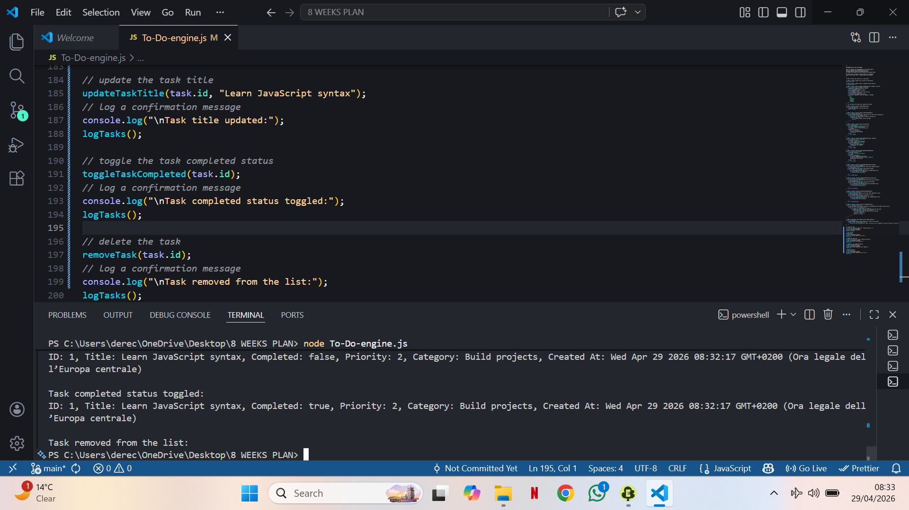

# TODO ENGINE

## Demo

Shocasing an image of the file executed in the terminal: what is visible is just the last part as the checking process 
comes to end with "updated", "completed" and "deleted" task.

## Description
This file contains the implementation of the To-Do Engine, which is responsible for managing the to-do list, including adding, 
removing, and updating tasks. The engine also handles task prioritization and categorization.

Use only arrays, functions, loops, primitives, and objects.
Avoid classes, Maps, Sets, or higher-order array methods.

## Features
- simulation of a user action at the bottom
- Create tasks to begin with
- Update tasks as the second step
- Sort tasks by viewing completed and incomplete ones
- Delete tasks after fulfilling the goal
- Filter tasks by category and priority

## Tech Used
- Vanilla JavaScript

## How it Works
- Tasks are stored in a JavaScript array in memory
- Each task is an object with id, title, category, priority, status, and time of creation
- A counter generates unique IDs for each task
- Functions manipulate the shared array directly
- Filtering and sorting use loop-based logic

## Learnings
- Working with objects to represent real-world data (tasks)
- Using arrays as a simple in-memory database
- Creating reusable functions instead of repeating code
- Breaking features into small single-purpose functions (create, add, update, delete)
- Understanding function inputs and outputs clearly
- Generating unique IDs using a counter
- Using IDs as a reliable way to find and manipulate specific items
- Searching data manually using loops
- Adding items with push
- Removing items with splice
- Filtering data using loops (category, priority, incomplete tasks)
- Sorting data using comparison logic (priority sorting)
- Keeping all tasks in a shared state (tasks array)
- Understanding how different functions affect shared data
- Seeing how state changes over time through operations
- Thinking in steps instead of one big solution
- Structuring logic before writing code
- Built a mini in-memory CRUD system (Create, Read, Update, Delete)

## Future Improvements
- Add “due date” for tasks
- Split code into separate modules (e.g. tasks.js, utils.js, app.js)
- Export/import functions using module.exports / require
- Separate logic (functions) from testing code
- Improve UI/UX

## Disclaimer
This project is a simple in-memory task manager built for learning purposes. 
It does not use a database or persistent storage.

## Author
Yoichi Isagi
